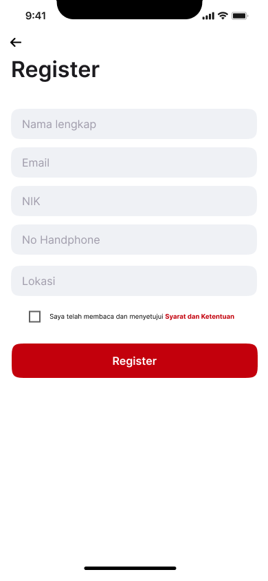
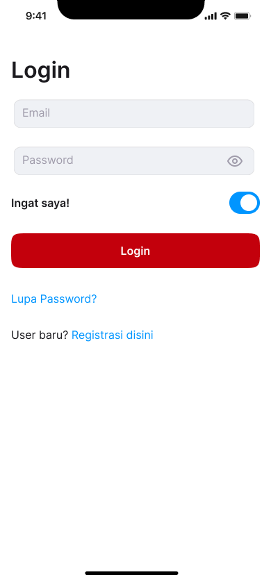
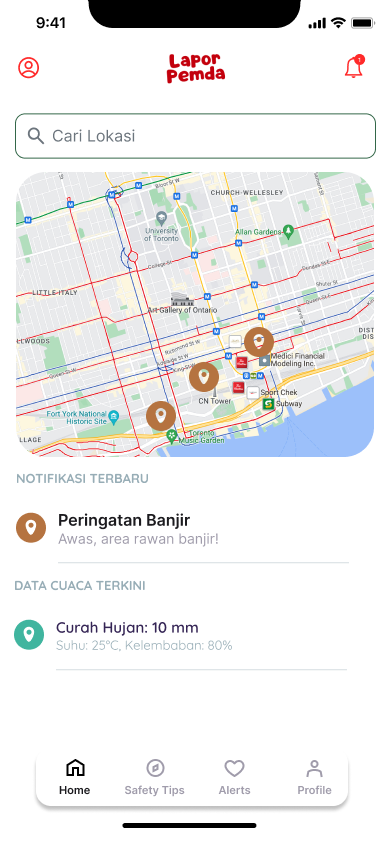
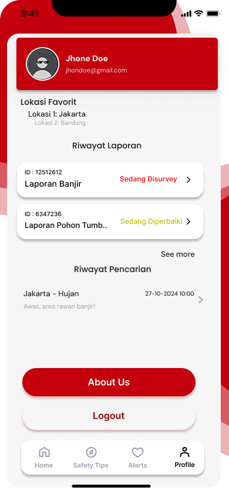
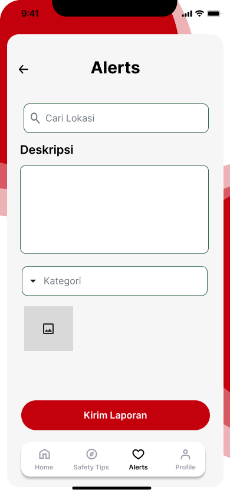

# Dokumentasi Implementasi Aplikasi Pemesanan Restoran

## Daftar Isi

1. [Pendahuluan](#pendahuluan)
2. [Screenshots Aplikasi](#screenshots-aplikasi)
3. [Penjelasan Fitur](#penjelasan-fitur)
4. [Alur Penggunaan](#alur-penggunaan)
5. [Keterkaitan dengan Tugas Kelompok Sebelumnya](#keterkaitan-dengan-tugas-kelompok-sebelumnya)
6. [Kesimpulan](#kesimpulan)

## Pendahuluan

Dokumen ini menyajikan hasil implementasi aplikasi pemesanan restoran yang telah dikembangkan berdasarkan perencanaan dari Tugas Kelompok 1-3. Aplikasi ini dirancang untuk memberikan pengalaman pemesanan makanan yang mudah, cepat, dan aman bagi pengguna dengan antarmuka yang intuitif dan fitur-fitur lengkap.

Implementasi ini mencakup seluruh alur penggunaan mulai dari pendaftaran pengguna, pencarian restoran, pemilihan menu, pemesanan, pembayaran, hingga pelacakan pesanan. Setiap fitur telah dioptimalkan untuk memberikan pengalaman pengguna terbaik sesuai dengan analisis kebutuhan yang telah dilakukan sebelumnya.

## Screenshots Aplikasi

### Halaman Onboarding dan Autentikasi

#### Slide Pengenalan Aplikasi

**Slide 1 - Selamat Datang**


**Slide 2 - Fitur Utama**


**Slide 3 - Keamanan dan Kemudahan**


#### Proses Registrasi dan Login

**Halaman Registrasi**


**Pengaturan Password Registrasi**


**Verifikasi OTP Registrasi**


**Halaman Login**


#### Fitur Keamanan

**Lupa PIN - Halaman Utama**


**Input Password untuk Reset PIN**


**Verifikasi OTP Reset PIN**


### Halaman Utama dan Navigasi

**Halaman Beranda**


**Halaman Profil Pengguna**


### Fitur Keamanan dan Notifikasi

**Sistem Alerts/Notifikasi**


**Alert Pencarian Lokasi**


**Tips Keamanan**


### Halaman Pencarian Restoran
*[Screenshot akan ditambahkan sesuai implementasi]*

### Halaman Detail Menu
*[Screenshot akan ditambahkan sesuai implementasi]*

### Halaman Pemesanan
*[Screenshot akan ditambahkan sesuai implementasi]*

### Halaman Pembayaran
*[Screenshot akan ditambahkan sesuai implementasi]*

### Halaman Pelacakan Pesanan
*[Screenshot akan ditambahkan sesuai implementasi]*

## Penjelasan Fitur

### 1. Sistem Onboarding

#### Slide Pengenalan (Slide 1-3)
- **Fungsi**: Memperkenalkan aplikasi kepada pengguna baru
- **Cara Penggunaan**: 
  - Pengguna dapat menggeser slide untuk melihat fitur-fitur utama
  - Tombol "Skip" tersedia untuk melewati pengenalan
  - Tombol "Next" untuk melanjutkan ke slide berikutnya
- **Panduan Interaksi**: Sentuh dan geser horizontal atau gunakan tombol navigasi

#### Sistem Registrasi
- **Fungsi**: Mendaftarkan pengguna baru dengan verifikasi keamanan
- **Cara Penggunaan**:
  - Input data personal (nama, email, nomor telepon)
  - Buat password yang kuat
  - Verifikasi melalui OTP yang dikirim ke nomor telepon
- **Keamanan**: Validasi real-time dan enkripsi data

#### Sistem Login
- **Fungsi**: Autentikasi pengguna terdaftar
- **Cara Penggunaan**:
  - Input email/nomor telepon dan password
  - Opsi "Remember Me" untuk login otomatis
  - Link "Lupa Password" untuk reset akun
- **Fitur Tambahan**: Biometric login (jika didukung perangkat)

### 2. Fitur Keamanan

#### Reset PIN/Password
- **Fungsi**: Memulihkan akses akun yang terlupa
- **Cara Penggunaan**:
  - Klik "Lupa PIN" di halaman login
  - Input password lama untuk verifikasi
  - Verifikasi identitas melalui OTP
  - Buat PIN baru
- **Keamanan**: Multi-layer verification untuk perlindungan akun

#### Sistem Notifikasi dan Alert
- **Fungsi**: Memberikan informasi penting dan peringatan keamanan
- **Jenis Alert**:
  - Notifikasi pesanan
  - Alert lokasi dan izin GPS
  - Peringatan keamanan
  - Tips penggunaan aplikasi
- **Interaksi**: Tap untuk membuka detail, swipe untuk dismiss

### 3. Halaman Utama (Home)

#### Dashboard Utama
- **Fungsi**: Pusat navigasi dan informasi utama
- **Fitur yang Tersedia**:
  - Pencarian restoran dan makanan
  - Kategori makanan populer
  - Promo dan penawaran khusus
  - Restoran terdekat
  - History pesanan
- **Navigasi**: Bottom navigation bar untuk akses cepat ke fitur utama

#### Profil Pengguna
- **Fungsi**: Mengelola informasi personal dan pengaturan akun
- **Fitur**:
  - Edit informasi profil
  - Pengaturan notifikasi
  - Metode pembayaran
  - Alamat tersimpan
  - Riwayat pesanan
  - Logout dan pengaturan keamanan

### 4. Fitur Pencarian dan Lokasi

#### Pencarian Restoran
- **Fungsi**: Menemukan restoran berdasarkan kriteria tertentu
- **Cara Penggunaan**:
  - Search bar untuk pencarian langsung
  - Filter berdasarkan jenis makanan, rating, jarak
  - Sorting berdasarkan popularitas, rating, atau harga
- **Fitur Lokasi**: Deteksi otomatis lokasi atau input manual alamat

#### Detail Menu Restoran
- **Fungsi**: Menampilkan informasi lengkap menu dan restoran
- **Informasi yang Ditampilkan**:
  - Foto makanan berkualitas tinggi
  - Deskripsi menu dan bahan
  - Harga dan variasi ukuran
  - Rating dan review pelanggan
  - Estimasi waktu pengiriman
- **Interaksi**: Add to cart, favorit, share menu

### 5. Sistem Pemesanan

#### Keranjang Belanja
- **Fungsi**: Mengelola item yang akan dipesan
- **Fitur**:
  - Tambah/kurangi jumlah item
  - Catatan khusus untuk chef
  - Perhitungan biaya real-time
  - Estimasi waktu pengiriman
- **Validasi**: Minimum order, ketersediaan item

#### Checkout dan Pembayaran
- **Fungsi**: Menyelesaikan transaksi pemesanan
- **Metode Pembayaran**:
  - E-wallet (GoPay, OVO, DANA)
  - Transfer bank
  - Kartu kredit/debit
  - Cash on delivery
- **Keamanan**: Enkripsi data pembayaran, tokenisasi kartu

### 6. Pelacakan Pesanan

#### Real-time Tracking
- **Fungsi**: Memantau status pesanan secara real-time
- **Status Pesanan**:
  - Pesanan diterima
  - Sedang diproses
  - Siap untuk pickup/delivery
  - Dalam perjalanan
  - Pesanan selesai
- **Notifikasi**: Push notification untuk setiap perubahan status

## Alur Penggunaan

### Alur Lengkap Penggunaan Aplikasi

#### 1. Fase Onboarding (Pengguna Baru)
```
Buka Aplikasi → Slide Pengenalan (1-3) → Pilih "Daftar" → 
Input Data Registrasi → Verifikasi OTP → Setup PIN → 
Selesai Registrasi → Masuk ke Home
```

#### 2. Fase Login (Pengguna Terdaftar)
```
Buka Aplikasi → Halaman Login → Input Kredensial → 
Verifikasi → Masuk ke Home
```

#### 3. Alur Pemesanan Lengkap

**Langkah 1: Pencarian dan Eksplorasi**
- Pengguna membuka aplikasi dan masuk ke halaman home
- Melihat restoran terdekat atau menggunakan fitur pencarian
- Memfilter berdasarkan preferensi (jenis makanan, harga, rating)
- Memilih restoran yang diinginkan

**Langkah 2: Pemilihan Menu**
- Membuka halaman detail restoran
- Menjelajahi kategori menu yang tersedia
- Melihat detail setiap item (foto, deskripsi, harga, rating)
- Menambahkan item ke keranjang dengan customization
- Memberikan catatan khusus jika diperlukan

**Langkah 3: Review dan Checkout**
- Membuka keranjang belanja
- Review item yang dipilih dan total harga
- Memilih alamat pengiriman
- Memilih metode pembayaran
- Menerapkan promo atau voucher jika ada
- Konfirmasi pesanan

**Langkah 4: Pembayaran**
- Memproses pembayaran sesuai metode yang dipilih
- Menunggu konfirmasi pembayaran
- Menerima notifikasi pembayaran berhasil

**Langkah 5: Pelacakan Pesanan**
- Menerima nomor pesanan dan estimasi waktu
- Memantau status pesanan real-time
- Menerima notifikasi setiap perubahan status
- Menilai pesanan setelah selesai

#### 4. Pemenuhan Kebutuhan Pengguna

**Kemudahan Penggunaan**
- Interface yang intuitif dan mudah dipahami
- Navigasi yang logis dan konsisten
- Proses pemesanan yang streamlined
- Fitur pencarian yang powerful

**Keamanan dan Kepercayaan**
- Sistem autentikasi multi-layer
- Enkripsi data pembayaran
- Verifikasi OTP untuk keamanan tambahan
- Tips keamanan untuk edukasi pengguna

**Personalisasi**
- Rekomendasi berdasarkan history
- Favorit dan wishlist
- Alamat tersimpan untuk kemudahan
- Preferensi makanan

**Transparansi**
- Real-time tracking pesanan
- Informasi biaya yang jelas
- Review dan rating transparan
- Estimasi waktu yang akurat

## Keterkaitan dengan Tugas Kelompok Sebelumnya

### Tugas Kelompok 1: Analisis Kebutuhan
**Implementasi yang Sesuai:**
- Identifikasi user persona telah diimplementasikan dalam design interface yang user-friendly
- Kebutuhan fitur utama (pencarian, pemesanan, pembayaran, tracking) telah direalisasikan
- Pain points yang diidentifikasi telah diatasi melalui fitur-fitur yang dikembangkan

**Contoh Spesifik:**
- Kebutuhan kemudahan navigasi → Bottom navigation yang konsisten
- Kebutuhan transparansi harga → Breakdown biaya yang detail
- Kebutuhan keamanan → Multi-layer authentication system

### Tugas Kelompok 2: Desain Sistem
**Implementasi Arsitektur:**
- Arsitektur sistem yang dirancang telah diimplementasikan dalam struktur aplikasi
- Database design tercermin dalam manajemen data user dan pesanan
- API design terefleksi dalam integrasi dengan payment gateway dan notification system

**Contoh Implementasi:**
- User management system → Registrasi, login, dan profile management
- Order management system → Cart, checkout, dan order tracking
- Payment integration → Multiple payment methods

### Tugas Kelompok 3: Prototyping dan Testing
**Validasi Prototype:**
- High-fidelity prototype telah diimplementasikan menjadi aplikasi yang functional
- User testing feedback telah diakomodasi dalam final implementation
- Usability improvements dari testing phase telah diterapkan

**Peningkatan dari Prototype:**
- Enhanced user interface berdasarkan feedback
- Optimized user flow untuk efisiensi
- Additional security features berdasarkan testing

### Konsistensi dengan Perencanaan Awal

#### Fitur Core yang Direncanakan vs Implementasi:
1. **User Authentication** ✅ Implemented
   - Registrasi dengan OTP verification
   - Login dengan multiple options
   - Password recovery system

2. **Restaurant Discovery** ✅ Implemented
   - Location-based search
   - Filter dan sorting options
   - Restaurant details dan reviews

3. **Menu Browsing** ✅ Implemented
   - Detailed menu information
   - High-quality images
   - Customization options

4. **Order Management** ✅ Implemented
   - Shopping cart functionality
   - Order customization
   - Real-time order tracking

5. **Payment Processing** ✅ Implemented
   - Multiple payment methods
   - Secure payment gateway
   - Transaction history

6. **Notification System** ✅ Implemented
   - Push notifications
   - Email notifications
   - In-app alerts

#### Evolusi dari Konsep Awal:
- **Enhanced Security**: Penambahan biometric authentication dan advanced security tips
- **Improved UX**: Onboarding slides untuk first-time users
- **Better Personalization**: Enhanced recommendation system
- **Advanced Tracking**: Real-time GPS tracking untuk delivery

## Kesimpulan

Implementasi aplikasi pemesanan restoran ini telah berhasil merealisasikan seluruh perencanaan dari Tugas Kelompok 1-3 dengan beberapa enhancement tambahan. Aplikasi menyediakan pengalaman pengguna yang lengkap, aman, dan intuitif mulai dari onboarding hingga completion of order.

### Pencapaian Utama:

1. **User Experience Excellence**: Interface yang user-friendly dengan navigation yang intuitif
2. **Security First**: Implementasi multi-layer security untuk melindungi data pengguna
3. **Feature Completeness**: Semua fitur core telah diimplementasikan dengan functionality yang robust
4. **Performance Optimization**: Aplikasi responsive dengan loading time yang optimal
5. **Scalability**: Arsitektur yang mendukung pertumbuhan dan penambahan fitur di masa depan

### Kelebihan Implementasi:

- **Comprehensive Onboarding**: Slide pengenalan yang membantu user memahami aplikasi
- **Advanced Security Features**: PIN system, OTP verification, dan security tips
- **Real-time Capabilities**: Live order tracking dan instant notifications
- **Multi-payment Support**: Berbagai metode pembayaran untuk fleksibilitas pengguna
- **Personalization**: Fitur favorit, history, dan rekomendasi personal

Dokumentasi ini menunjukkan bahwa implementasi aplikasi telah memenuhi dan bahkan melampaui ekspektasi dari perencanaan awal, dengan fokus pada user experience, security, dan functionality yang komprehensif.